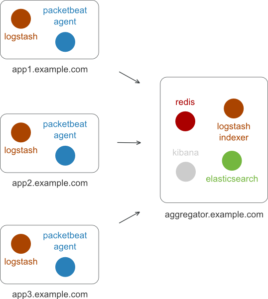
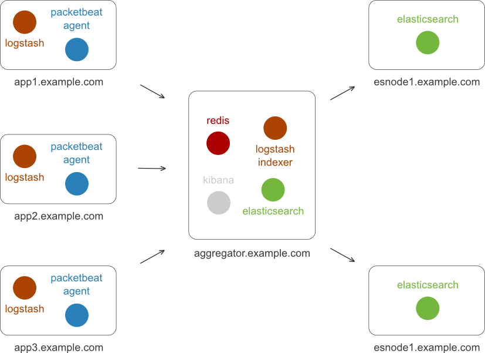

Ansible roles for Packetbeat + ELK
==================================

This repository contains automation scripts based on Ansible for deploying the
full Packetbeat system. It is a quick way of getting everything up and running.

It will install the following components for you:

* [Packetbeat](http://packetbeat.com) reads and parses network protocols on the
  fly, correlating the requests with the responses and measuring the response times.

* [Elasticsearch](http://elasticsearch.org) is a distributed search system that indexes
  semi-structured data (i.e. JSON documents) and can do ad-hoc analytics on
  them.

* [Logstash](http://logstash.net) reads, ships and aggregates log files, but it can be used for other
  data as well.

* [Kibana](http://kibana.org) is a UI application that offers various visualisations widgets which
  you can flexibly organize into dashboards.

* [Redis](http://redis.io) is an in-memory data structure server which can do a lot of things,
  here we just use it as a queue with multiple writers.

All these tools are not only able to work together, but they were **designed**
to be composable and work together. So while the amount of projects involved
might seem overwhelming, as a user you don't really have to care. Follow our
tutorial to get everything up and running and then simply use the web
interface.

## Deploy steps (high level overview - more details below)

**Step 1:** Spin up one or more Virtual Machines that will host the monitoring system.

**Step 2:** Clone or download this GitHub project:

    git clone https://github.com/packetbeat/packetbeat-deploy.git

**Step 3:** Create an inventory file containing your servers. It looks something
  like this:

    [esnodes]
    10.50.10.13
    10.50.10.14

    [aggregator]
    10.50.10.15

**Step 4:** Adjust the configuration files if you want to. The defaults should be good in most cases.

**Step 5:** Install Ansible and run one command to deploy everything:

    ansible-playbook -i hosts site.yml

## Tutorial

The following sections cover in detail the steps you need to take to build your
own packet analytics and log aggregation system.

### Step 1: Decide on the architecture and get servers

In this tutorial, we'll give two examples:

* an all-in-one installation, in which all components except the agents are
  running on a single server. This is useful for trying things and for
  applications without too much traffic. No redundancy is provided in
  this setup.

* an installation on 3 servers. All servers run an Elasticsearch node and one
  of them also has the *aggregator* role and serves the Kibana web interface.
  In this setup the data is duplicated to one replica, so loosing one of the
  severs doesn't mean data loss. If the *aggregator* node is lost, the system
  doesn't record data for the time the *aggregator* is down, but the data that
  was already indexed is not lost.

Because the Deploy system itself is open-source, you can easily extend it later
to more elaborate designs, including removing the single point of failure.

The servers running the Aggregator node and the Elasticsearch nodes currently
need to be *Debian 7* or newer. Extending this to support more operating system
is easy, but for now we want to keep our testing efforts lower.

Most cloud providers offer Debian images. For example, on [Digital
Ocean](http://digitalocean.com), you can select the `Debian 7.0 x64` image:

  

If you want to run the Packetbeat system on one or more physical servers,
you need to install Debian 7 on all of them.

Note that the Debian 7 is a requirement only for the servers running the
Packetbeat Monitoring System itself. Your applications servers can run any
Debian based (e.g. Ubuntu) or RedHat based (e.g. CentOS, Oracle Linux)
distribution. Running the Packetbeat agents is also possible on Windows, but
Packetbeat Deploy currently doesn't support it.

We recommend using servers with at least 512 MB RAM each.

### Step 2: Clone the Packetbeat Deploy repository

You should run this and the next steps on a computer that has SSH access to all
the servers, ideally using key based authentication.

If you have Git installed on your computer, simply run:

    git clone https://github.com/packetbeat/packetbeat-deploy.git

If you plan to modify the deploy scripts and you are fine with storing the
configuration files on GitHub, it might be a good idea to first fork this
repository and then clone your fork.

### Step 3: Create the inventory file

An Ansible [inventory file](http://docs.ansible.com/intro_inventory.html) is a
simple configuration file defining your network. It typically groups hosts by
their intended role in your system.

Let's start by creating an inventory file named ``hosts`` in the
``packetbeat-deploy`` folder.

For the **all-in-one** example, your inventory file should look something like
this:

    # packetbeat-deploy/hosts

    [aggregator]
    aggregator.example.com

    [app-servers]
    app1.example.com
    app2.example.com
    app3.example.com

In this example, the ``aggregator.example.com`` is the hostname of the system
running the monitoring system. The rest of the servers are your application
servers, on which Packetbeat Deploy will install the Packetbeat and Logstash
agents.

 

You can also use IP addresses instead of hostnames, something like
this:

    # packetbeat-deploy/hosts

    [aggrgator]
    10.50.10.15

    [app-servers]
    10.50.50.1
    10.50.50.2
    10.50.50.2

If you don't want to use Ansible for installing the Packetbeat and Logstash
agents (for example, if you already do that via Chef or Puppet), you can simply
remove the ``[app-servers]`` section from the inventory file, so you get
something like this:

    # packetbeat-deploy/hosts

    [aggrgator]
    10.50.10.15

For the **installation on 3 severs**, your inventory file should look something
like this:

    # packetbeat-deploy/hosts

    [aggregator]
    packetbeat.example.com

    [esnodes]
    esnode1.example.com
    esnode2.example.com

    [app-servers]
    app1.example.com
    app2.example.com
    app3.example.com

 

The inventory file can also contain configuration options on a per host basis.
One usage for this is setting the interface on which the services bind to. The
default is ``eth0``, but in some cases you might want to use a different
device. You can change the interface like this:

    # packetbeat-deploy/hosts

    [aggregator]
    packetbeat.example.com main_iface=eth1

    [esnodes]
    esnode1.example.com main_iface=eth1
    esnode2.example.com main_iface=eth1

    [app-servers]
    app1.example.com
    app2.example.com
    app3.example.com

Another parameter that you might need to adjust is the SSH user that should be
used by Ansible to connect to the servers. The parameter is named
``ansible_ssh_user`` and you can set it like this:

    # packetbeat-deploy/hosts

    [aggregator]
    packetbeat.example.com ansible_ssh_user=root

### Step 4: Adjust configuration files

Packetbeat Deploy generally uses sane defaults and uses environmental
information to automatically set the right configuration parameters. For
example, it automatically configures Elasticsearch to use half of the available
memory on each node. So while you normally don't need to change any of the
default configuration variables, you can have a look over the following files
to see if you want anything different. Packetbeat Deploy keeps the options
organized per role, so you have too look into the ``vars`` folder of each role:

    roles/esnode/vars/main.yml
    roles/aggregator/vars/main.yml
    roles/kibana/vars/main.yml
    roles/packetbeat/vars/main.yml
    roles/logstash/vars/main.yml

In particular you might want to ship different log files from the logstash
configuration:

    # roles/logstash/vars/main.yml
    ...
        file_inputs:
            syslog:
                enabled: true
                path:
                        - "/var/log/syslog"
                        - "/var/log/messages"
            nginx_access:
                enabled: true
                path:
                        - "/var/log/nginx/access.log"
            nginx_error:
                enabled: true
                path:
                        - "/var/log/nginx/error.log"
    ...

You might also want to adjust the TCP ports that the Packetbeat agent sniffs
on:

    # roles/packetbeat/vars/main.yml
    ...
        protocols:
            http:
                enabled: true
                ports:
                    - 80
                    - 8080
            mysql:
                enabled: true
                ports:
                    - 3306
            pgsql:
                enabled: true
                ports:
                    - 5432
            redis:
                enabled: true
                ports:
                    - 6379
    ...

If your application doesn't use some of the protocols above, simply set
``enabled`` to false to disable them.

Another important setting is the amount of history the Packetbeat Monitoring
System stores. A nightly curator task will delete all indexes older than a
given amount of days. The default is 3 days, which we think is usually enough
for troubleshooting while keeping the disk requirements relatively low. You can
change it from the *Aggregator* ``vars`` file:

    # roles/aggregator/vars/main.yml
    aggregator:
        ...
        config:
            days_of_history: 3
        ...

### Step 5: Install Ansible and run the playbook

There are [multiple ways](http://docs.ansible.com/intro_installation.html) to
install Ansible, you should choose the one that makes the most sense on your
operating system. However, if you have python already installed, the following
steps should be enough:

        sudo easy_install pip
        pip install ansible

Now it's time to get everything up by running the following command:

        ansible-playbook  -i hosts site.yml

Where ``hosts`` is the inventory file you created in Step 3.

After the installation is finished, you can access the web interface by opening
the Aggregator's URL in the browser.

## Developing / Testing

Vagrant can be used for testing Packetbeat Deploy. The ``Vagrantfile`` contains
definitions for 5 VMs that we use for testing.

To bring the test system up, do the following:

        vagrant up

Add the SSH connection information to your SSH config, from where Ansible can
read it:

        vagrant ssh-config >> ~/.ssh/config

Now you are ready to run the Ansible roles:

        ansible-playbook -i hosts-vagrant site.yml

Or for the all-in-one version (installs the full Packetbeat System on the
aggregator host):

        ansible-playbook -i hosts-vagrant-allinone site.yml
